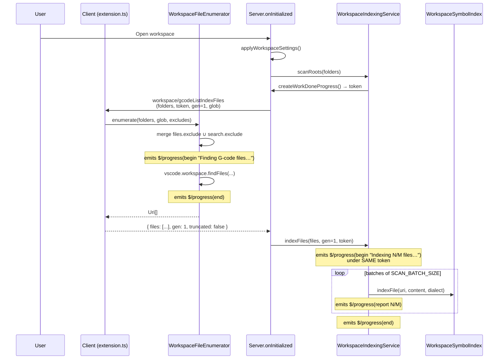
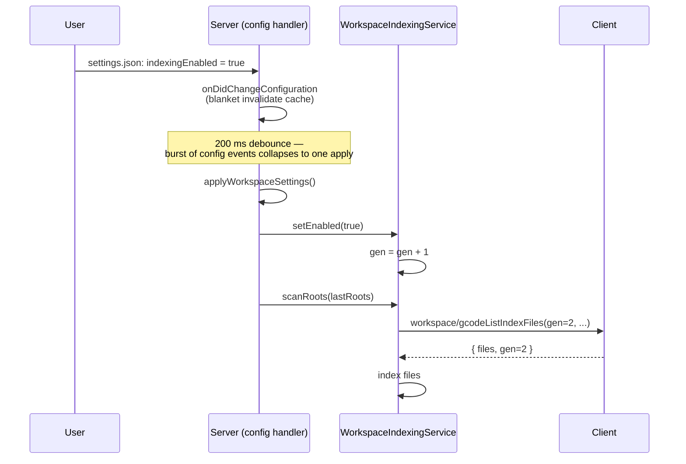
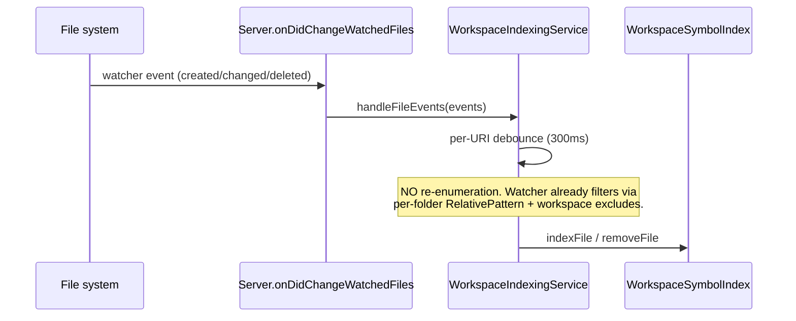
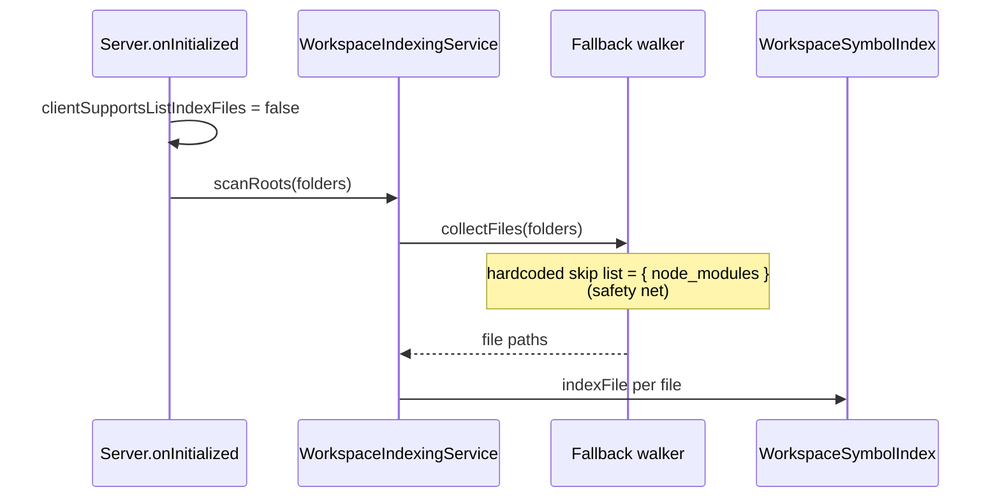
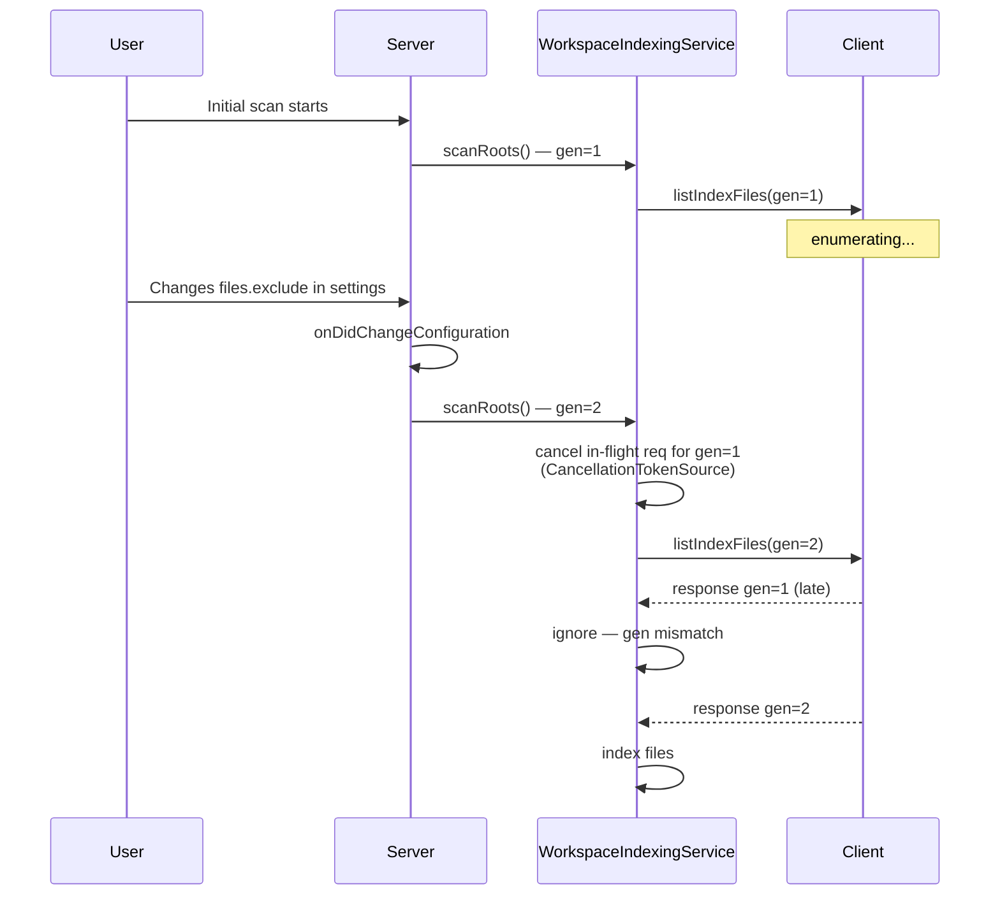

# Architecture Design — Issue #138

**workspace-symbols: honor `files.exclude` / `search.exclude` when scanning**

---

## 1. Goals & Non-Goals

**Goals**

- Move workspace file enumeration from server (`fs.readdir` + hardcoded skip list) to client (`vscode.workspace.findFiles`) so user-configured `files.exclude` / `search.exclude` are honored automatically.
- Keep symbol extraction (lexer / parser / `WorkspaceSymbolIndex`) on the server. Only enumeration moves.
- Cover three lifecycle entry points uniformly: cold initial scan, `gcode.workspace.indexingEnabled` toggle off→on, file-watcher events.
- Two-phase progress UX: client "Finding G-code files…" then server "Indexing N/M files…".
- Graceful degrade for non-VSCode LSP clients.

**Non-goals**

- Per-folder excludes in multi-root workspaces (deferred to #141).
- Exclude awareness for non-indexing operations (tracked in #139).
- Any change to `WorkspaceSymbolIndex` storage shape, symbol kinds, or limits.
- Cancellation across other LSP request types (we add cancellation only on the new request and the scan loop).

---

## 2. High-Level Architecture

```mermaid
flowchart LR
    subgraph Client[VSCode Client]
        Ext[extension.ts]
        Enum[WorkspaceFileEnumerator<br/>findFiles + exclude merge]
        Cfg[VSCode workspace config]
    end

    subgraph Server[Language Server]
        Init[onInitialized / applyWorkspaceSettings]
        WIS[WorkspaceIndexingService]
        Fallback[Fallback walker<br/>node_modules safety net]
        Idx[WorkspaceSymbolIndex]
    end

    Cfg -->|files.exclude<br/>search.exclude| Enum
    Init -->|workspace/gcodeListIndexFiles| Enum
    Enum -->|URI[] response| WIS
    WIS -->|readFile + indexFile| Idx
    WIS -.->|capability missing| Fallback
    Fallback --> Idx
```

The server is still the lifecycle owner. When it wants to (re-)scan, it issues a **server→client request** asking the client to enumerate. The client runs `findFiles` and returns the URI list. The server then reads file contents and feeds them through the existing index pipeline.

---

## 3. The New LSP Request

### 3.1 Direction

**Server → Client.** The server stays in control of when indexing happens (initial scan, config-change rescan, manual re-enable). It asks the client for a fresh file list each time. The client is a passive enumeration provider. This avoids any "client must know when to push" coordination.

### 3.2 Method name

`workspace/gcodeListIndexFiles` — under the `experimental` capability namespace, no `$/` prefix (that prefix is reserved for built-in protocol notifications).

### 3.3 TypeScript types (sketch)

```ts
// src/lsp/gcodeListIndexFiles.ts (new shared module imported by client + server)

import { RequestType, ProgressToken } from 'vscode-languageserver-protocol';

export interface GCodeListIndexFilesParams {
  /** Workspace folder URIs the server wants enumerated. Empty array = entire workspace. */
  readonly folders: readonly string[];

  /** Server-allocated WorkDoneProgress token for the "Finding files…" phase. */
  readonly workDoneToken?: ProgressToken;

  /**
   * Monotonic scan generation. Echoed back so the server can detect stale responses
   * arriving after a newer scan was started. See §7.
   */
  readonly scanGeneration: number;

  /**
   * Include glob the server wants matched. Today: '**\/*.{nc,gcode,...}'.
   * Server is the source of truth for which extensions count as G-code.
   */
  readonly includeGlob: string;
}

export interface GCodeListIndexFilesResult {
  /** Flat list of file URIs found. Order is not significant. */
  readonly files: readonly string[];

  /** Echoed scan generation. */
  readonly scanGeneration: number;

  /** True if the client truncated results (e.g. hit `maxResults`). */
  readonly truncated: boolean;
}

export const GCodeListIndexFilesRequest = new RequestType<
  GCodeListIndexFilesParams,
  GCodeListIndexFilesResult,
  void
>('workspace/gcodeListIndexFiles');
```

### 3.4 Capability declaration

**Client capability** (sent in `initializationOptions` / `clientCapabilities.experimental`):

```ts
// extension.ts → LanguageClientOptions.initializationOptions
{
  experimental: {
    gcode: {
      listIndexFiles: {
        version: 1;
      }
    }
  }
}
```

**Server reads it** in `onInitialize`:

```ts
const clientSupportsListIndexFiles =
  !!params.initializationOptions?.experimental?.gcode?.listIndexFiles;
```

The server stores this on a small `ClientFeatureFlags` object that `WorkspaceIndexingService` consults via DI (so unit tests can flip it).

---

## 4. Sequence Diagrams

### 4.1 Cold initial scan (VSCode client, capability present)



Key wiring point: the **server creates the token, includes it in the request**, the client emits `begin/report/end` for enumeration under that token, then the server emits `begin/report/end` for indexing under the **same token**. Two phases, one progress UI handle.

### 4.2 `indexingEnabled` off → on toggle



`lastRoots` is already preserved on disable (#126). Re-enable just calls `scanRoots` again, which goes through the same enumeration path.

### 4.3 File-watcher event



**Key insight:** the existing per-folder `RelativePattern` watcher (#126, kept for parcel-watcher Linux cold-start) already applies the user's `files.watcherExclude`. We do **not** re-enumerate on watcher events. We only re-validate the URI against the same exclude rules to belt-and-brace the case where a watcher fires for a path that should not be indexed.

That validation lives client-side: when an URI arrives at the watcher and the server forwards it to indexing, the server checks the URI against a cached "last known excludes" set (carried in `WorkspaceIndexingService` from the last enumeration). If the URI matches an exclude, drop it.

> **Alternative considered:** delegate per-event filtering back to the client via a second custom request. Rejected — too chatty and the watcher already filters at the OS level for the dominant cases.

### 4.4 Non-VSCode client (capability absent)



The fallback path is the existing `WorkspaceIndexingService` walker, with the skip list trimmed from `{node_modules, .git, dist, out, .vscode-test}` to `{node_modules}` only. We retain `node_modules` because non-VSCode clients have no equivalent of `files.exclude` to lean on, and a `node_modules` walk on a typical project is catastrophic.

### 4.5 Cancellation / re-entry mid-scan



Mechanism:

1. `WorkspaceIndexingService` holds a `currentScanGeneration: number` and a `currentScanCts: CancellationTokenSource | undefined`.
2. Each `scanRoots()` call: increments `currentScanGeneration`, cancels the previous CTS, creates a new one, sends the request with the new token + new generation.
3. When a response arrives, compare `result.scanGeneration === currentScanGeneration`. Mismatch → drop the result silently.
4. The indexing loop also checks the generation between batches (`if (gen !== this.currentScanGeneration) break`). This handles the case where generation flipped after the request returned but during the indexing pass.
5. On `setEnabled(false)`: cancel the CTS and bump the generation.

---

## 5. Progress Reporter Contract

| Phase     | Owner  | Token source                                                                                | begin                                                                    | report                                                                        | end                         |
| --------- | ------ | ------------------------------------------------------------------------------------------- | ------------------------------------------------------------------------ | ----------------------------------------------------------------------------- | --------------------------- |
| Enumerate | Client | Server creates via `connection.window.createWorkDoneProgress()`, includes in request params | Client emits `{kind:'begin', title:'Finding G-code files…'}`             | (none — `findFiles` is opaque)                                                | Client emits `{kind:'end'}` |
| Index     | Server | **Same token** as above                                                                     | Server emits `{kind:'begin', title:'Indexing 0/N files…', percentage:0}` | Server emits `{kind:'report', percentage, message:'Indexing N/M…'}` per batch | Server emits `{kind:'end'}` |

Why share one token: the user sees a single progress notification that morphs through both phases — no flash, no double-popup. Progress % resets at the phase boundary (enumerate is 0–100% indeterminate, index is 0–100% determinate).

`ProgressReporter` interface in `WorkspaceIndexingService` stays the same. The `progressFactory` returns a reporter that wraps a token chosen by the **scanRoots** caller (so we can either reuse a token across phases or allocate a new one — see §8 Q3).

> **Decision (final):** Server-allocated token via `connection.window.createWorkDoneProgress()` is the approach for this PR. The client-allocated alternative (Q3 Option C) is **out of scope** — accepted as a future optimization if the extra round-trip ever shows up in profiling.

---

## 6. File-by-file Change List

### New files

| File                                                           | Purpose                                                                                                                                                     |
| -------------------------------------------------------------- | ----------------------------------------------------------------------------------------------------------------------------------------------------------- |
| `src/lsp/gcodeListIndexFiles.ts`                               | Shared `RequestType`, params/result interfaces, capability constant. Imported by both client and server (no VSCode dep).                                    |
| `src/client/WorkspaceFileEnumerator.ts`                        | Class that handles the request: merges `files.exclude` + `search.exclude`, builds glob, calls `vscode.workspace.findFiles`, emits enumeration `$/progress`. |
| `src/providers/ClientFeatureFlags.ts`                          | Tiny DI struct: `{ supportsListIndexFiles: boolean }`. Set in `onInitialize`, injected into `WorkspaceIndexingService`.                                     |
| `src/test/providers/WorkspaceIndexingService.fallback.test.ts` | Unit test verifying fallback path is taken when capability flag is false, and that `node_modules` is the only directory skipped.                            |
| `src/test/client/WorkspaceFileEnumerator.test.ts`              | Unit test for the client enumerator: exclude merge, glob construction, progress emission. Uses mocked `vscode.workspace.findFiles`.                         |
| `src/e2e/suite/workspaceExcludes.test.ts`                      | E2E test: write a workspace with a `build/` folder excluded via `files.exclude`, verify symbols from `build/` are not in the index.                         |
| `src/e2e/fixtures/workspace-with-excludes/`                    | Fixture: G-code files inside and outside excluded directories, plus a `.vscode/settings.json` with `files.exclude` and `search.exclude`.                    |

### Modified files

| File                                                                  | Change sketch                                                                                                                                                                                                                                                                                                                                                                                                                                                                                                                                                                                                                                                                                                                                                                                                                                                                                                                                                                                                                                |
| --------------------------------------------------------------------- | -------------------------------------------------------------------------------------------------------------------------------------------------------------------------------------------------------------------------------------------------------------------------------------------------------------------------------------------------------------------------------------------------------------------------------------------------------------------------------------------------------------------------------------------------------------------------------------------------------------------------------------------------------------------------------------------------------------------------------------------------------------------------------------------------------------------------------------------------------------------------------------------------------------------------------------------------------------------------------------------------------------------------------------------- |
| `src/server/server.ts`                                                | (a) `onInitialize` reads `clientSupportsListIndexFiles` from `params.initializationOptions.experimental.gcode.listIndexFiles` and stores it on a `ClientFeatureFlags` instance. (b) Pass that flags object into `WorkspaceIndexingService` constructor. (c) Wrap `applyWorkspaceSettings()` in a 200 ms trailing debounce so a burst of `onDidChangeConfiguration` events collapses to one scan (resolves §11 risk #2). The debounce wrapper lives in `server.ts` itself, not inside `applyWorkspaceSettings`, so direct callers (`onInitialized`) can still invoke synchronously when desired.                                                                                                                                                                                                                                                                                                                                                                                                                                              |
| `src/providers/WorkspaceIndexingService.ts`                           | (a) Constructor takes `ClientFeatureFlags` and a `requestFiles(params): Promise<Result>` callback (DI for `connection.sendRequest`, keeps service free of LSP types). (b) `scanRoots` becomes the orchestrator: bumps generation, cancels previous CTS, calls either `enumerateViaClient()` or `collectFiles()` (existing fallback). (c) New private `enumerateViaClient()` that builds params, awaits `requestFiles`, validates generation, then proceeds to indexing loop. (d) `SKIPPED_DIRECTORIES` trimmed to `new Set(['node_modules'])`. (e) Indexing loop checks `currentScanGeneration` between batches. (f) `handleFileEvents`: filter URIs against last-known excludes (cached from the most recent enumerate response — store as a `Set<string>` of normalized URIs the enumerate phase rejected, OR store the include glob+excludes and re-test client-side). Simplest: store the **set of currently-indexed URIs** and reject events for unknown paths only when adding (not when removing). See §8 Q4 for the full discussion. |
| `src/client/extension.ts`                                             | (a) Build `initializationOptions` declaring the `experimental.gcode.listIndexFiles` capability. (b) Construct `WorkspaceFileEnumerator` after `LanguageClient` start. (c) Wire `client.onRequest(GCodeListIndexFilesRequest, params => enumerator.handle(params))`.                                                                                                                                                                                                                                                                                                                                                                                                                                                                                                                                                                                                                                                                                                                                                                          |
| `src/server/server.ts` (wiring)                                       | Inject the `requestFiles` callback into `WorkspaceIndexingService` as `(params) => connection.sendRequest(GCodeListIndexFilesRequest, params, cancellationToken)`.                                                                                                                                                                                                                                                                                                                                                                                                                                                                                                                                                                                                                                                                                                                                                                                                                                                                           |
| `src/providers/__tests__/WorkspaceIndexingService.test.ts` (existing) | Add tests for: generation cancellation, capability-flag branching, exclude-aware filtering of watcher events.                                                                                                                                                                                                                                                                                                                                                                                                                                                                                                                                                                                                                                                                                                                                                                                                                                                                                                                                |

### Untouched

- `WorkspaceSymbolIndex` — no API change. We still call `indexFile`, `removeFile`, `clear` exactly as today.
- Lexer / parser / formatter / databases — irrelevant.
- `ServerConfigProvider` — `files.exclude` / `search.exclude` are read on the **client** side, not the server. The server never asks for those settings.

---

## 7. Generation & Cancellation State Machine

```
                    ┌──────────────┐
                    │   IDLE       │  gen=N, cts=undef
                    └──────┬───────┘
                           │ scanRoots()
                           ▼
                    ┌──────────────┐
        ┌──────────►│ ENUMERATING  │  gen=N+1, cts=fresh
        │           └──────┬───────┘
        │                  │ response.gen == N+1
        │                  ▼
        │           ┌──────────────┐
        │           │  INDEXING    │  gen=N+1, cts=fresh
        │           └──────┬───────┘
        │                  │ done
        │                  ▼
        │           ┌──────────────┐
        │           │   IDLE       │
        │           └──────┬───────┘
        │                  │
        │   scanRoots() (rescan)
        └──────────────────┘

Side transitions (any state → ENUMERATING):
  - setEnabled(true) when previously false
  - applyWorkspaceSettings() after config change
  - scanRoots() invoked again

Side transitions (any state → IDLE):
  - setEnabled(false): cts.cancel(), clear index, gen++
```

Generation bump rules:

- Increment **before** sending the new request.
- Always cancel the previous CTS first (no-op if undefined).
- A late response with `result.scanGeneration < currentScanGeneration` is dropped silently (debug-logged).
- A late response with `result.scanGeneration > currentScanGeneration` cannot happen by construction.

---

## 8. Deferred Questions — Recommendations

### Q1. LSP request shape — server→client request, batched URI[] result

**Recommendation:** Server-initiated request `workspace/gcodeListIndexFiles` with the params/result types in §3.3.

| Option                                                          | Pros                                                                                                                                                                       | Cons                                                                                                                                 |
| --------------------------------------------------------------- | -------------------------------------------------------------------------------------------------------------------------------------------------------------------------- | ------------------------------------------------------------------------------------------------------------------------------------ |
| **A. Server→client request, batched (chosen)**                  | Server stays in control of lifecycle; matches `findFiles` natively (it's batched anyway); single round-trip; trivial cancellation via `connection.sendRequest(..., token)` | Whole URI list crosses the wire at once (memory)                                                                                     |
| B. Client→server notification ("here are the files")            | Client owns when to push                                                                                                                                                   | Server has no way to ask for a fresh list (rescan) without inventing a separate "please rescan" notification — strictly more complex |
| C. Server→client request, streaming via `$/progress` data items | Bounded memory per chunk                                                                                                                                                   | `findFiles` doesn't stream — we'd batch on the client and chunk artificially. Pure complexity for no real benefit                    |

For the largest realistic G-code workspace (think 50k files at ~100 bytes per URI), the JSON-RPC payload is ~5 MB. Acceptable. If we ever hit that ceiling we add a `truncated` flag (already in the result type) and revisit chunking.

### Q2. Stream vs batch — batch

**Recommendation:** Batch.

| Option                | Pros                                                                                          | Cons                                                                                                 |
| --------------------- | --------------------------------------------------------------------------------------------- | ---------------------------------------------------------------------------------------------------- |
| **Batch (chosen)**    | Matches `findFiles` natively; one request, one response; simpler progress; fewer LSP messages | Whole list in memory once                                                                            |
| Stream via $/progress | Bounded memory; could overlap enumerate + index                                               | `findFiles` is opaque — we'd buffer client-side anyway. Real bottleneck is parsing, not enumeration. |

Server already batches the **indexing** pass internally (`SCAN_BATCH_SIZE = 50`), which is where the heavy work is. Streaming enumeration buys nothing.

### Q3. Progress handoff — server allocates token, both phases share it

**Recommendation:** Server creates one `WorkDoneProgress` token via `connection.window.createWorkDoneProgress()`, includes it in the request params, both phases emit `$/progress` under that one token.

| Option                                               | Pros                                                                                                    | Cons                                                                                                         |
| ---------------------------------------------------- | ------------------------------------------------------------------------------------------------------- | ------------------------------------------------------------------------------------------------------------ |
| **A. Single shared server-allocated token (chosen)** | One progress UI element that morphs through both phases; no flicker; matches LSP 3.17 idiomatic pattern | Server is the token issuer (no problem in practice)                                                          |
| B. Two separate tokens (one per phase)               | Clear separation in code                                                                                | User sees the indicator disappear and reappear; jarring on cold scans                                        |
| C. Client-allocated token                            | Lower latency (avoids `createWorkDoneProgress` round-trip)                                              | Server initiated request, so client doesn't know to allocate one until after the request arrives — backwards |

Sequencing rule: client emits `begin` and `end` for enumeration phase **before** returning the response. Server emits `begin` for indexing phase **after** receiving the response. There is a momentary gap between enumerate-`end` and index-`begin`; in practice it is sub-millisecond. If users report flicker, we can suppress the enumerate-`end` and let indexing's `begin` overwrite it (LSP allows multiple `begin` events under a single token only in some implementations — flag as a follow-up if it materializes).

### Q4. Cancellation / re-entry — generation counter + CancellationTokenSource

**Recommendation:** See §7. One generation int + one CTS, both held by `WorkspaceIndexingService`. Each `scanRoots` bumps gen, cancels previous CTS, sends with new CTS.

For watcher events colliding with an in-flight scan: do **not** cancel the scan. The watcher and the scan are independent — the scan is bulk indexing, the watcher is single-file delta. The scan may finish with stale URI rules, then the watcher's delta corrects it. Ordering invariant: every watcher event goes through `processChange()`, which is per-URI; the bulk scan's `indexFile` for that same URI is idempotent (it always `removeFile` first). So order does not matter.

For excludes-changed mid-scan: the server has no direct signal that `files.exclude` changed (it's a client-side setting). The closest signal is `onDidChangeConfiguration`, which the server already handles by blanket-invalidating its cache and re-running `applyWorkspaceSettings`. That re-runs `scanRoots`, which bumps the generation and cancels the in-flight scan. **No special handling required** beyond what §7 already prescribes.

For watcher events that should now be filtered after the user added a new exclude: solved by the next scanRoots cycle. We do not retroactively prune the index here — too clever, too easy to get wrong, and the bulk scan that follows the config change will overwrite stale state via `indexFile`'s remove-then-add semantics.

> **Known limitation (accepted by lead):** Until the post-config-change bulk scan completes, the index may contain a few entries from a just-excluded directory. The index converges within seconds because `onDidChangeConfiguration` triggers a (debounced) `applyWorkspaceSettings` → `scanRoots` cycle. This footgun is documented in the README "Known limitations" section and in the architecture solution doc cross-referenced from §10.

---

## 9. Testing Strategy

### Unit tests (Jest)

| Test                                                   | What it verifies                                                                                                                                                                                                                                                                                                                                            |
| ------------------------------------------------------ | ----------------------------------------------------------------------------------------------------------------------------------------------------------------------------------------------------------------------------------------------------------------------------------------------------------------------------------------------------------- |
| `WorkspaceIndexingService.fallback.test.ts`            | Capability flag false → uses `collectFiles` walker; `node_modules` only is skipped.                                                                                                                                                                                                                                                                         |
| `WorkspaceIndexingService.test.ts` (extend)            | (a) Capability flag true → calls injected `requestFiles` callback with correct params shape. (b) Generation mismatch → response is dropped. (c) `setEnabled(false)` cancels in-flight CTS. (d) Indexing loop bails between batches when generation flips.                                                                                                   |
| `server.applyWorkspaceSettings.debounce.test.ts` (new) | Rapid burst of `onDidChangeConfiguration` events within 200 ms collapses to a single `applyWorkspaceSettings` invocation; a single late event after the debounce window fires its own apply. Uses fake timers.                                                                                                                                              |
| `WorkspaceFileEnumerator.test.ts`                      | (a) Reads `files.exclude` and `search.exclude` from a mocked `vscode.workspace.getConfiguration()`. (b) Merges them into a single brace-expanded glob. (c) Calls `vscode.workspace.findFiles(include, mergedExclude)`. (d) Emits `$/progress(begin)` and `$/progress(end)` under the supplied token. (e) Returns correct `GCodeListIndexFilesResult` shape. |

### E2E tests (Mocha + `@vscode/test-cli`)

| Test                                                                         | Setup                                                                                                                                                                                                                             |
| ---------------------------------------------------------------------------- | --------------------------------------------------------------------------------------------------------------------------------------------------------------------------------------------------------------------------------- |
| `workspaceExcludes.test.ts: respects files.exclude`                          | Fixture workspace with `src/main.nc`, `build/output.nc`, and `.vscode/settings.json` declaring `"files.exclude": { "build": true }`. After extension activation, query workspace symbols — assert `output.nc` symbols are absent. |
| `workspaceExcludes.test.ts: respects search.exclude`                         | Same but with `search.exclude` instead of `files.exclude`.                                                                                                                                                                        |
| `workspaceExcludes.test.ts: union of both`                                   | Both settings; assert union semantics.                                                                                                                                                                                            |
| `workspaceExcludes.test.ts: re-enable triggers exclude-aware rescan`         | Start with `indexingEnabled: false`, flip to true, assert excludes still honored on the rescan.                                                                                                                                   |
| `workspaceExcludes.test.ts: file-watcher event for excluded path is ignored` | After initial index, write a new file inside `build/`, assert it does not enter the index.                                                                                                                                        |

### Test fixtures

```
src/e2e/fixtures/workspace-with-excludes/
├── .vscode/
│   └── settings.json    # files.exclude + search.exclude
├── src/
│   ├── main.nc          # should be indexed
│   └── helper.nc        # should be indexed
├── build/               # excluded via files.exclude
│   └── output.nc        # must NOT be indexed
└── cache/               # excluded via search.exclude
    └── stale.nc         # must NOT be indexed
```

### Manual smoke (PR description checklist)

- Open a workspace with `node_modules` containing `.nc` files; verify they're not indexed.
- Toggle `gcode.workspace.indexingEnabled` off and on; observe two-phase progress.
- Edit `files.exclude` to add a new pattern; observe rescan.

---

## 10. Migration / Rollout

- **No new user-facing config flag.** The feature is on by default in VSCode (capability declared unconditionally) and off by default for non-VSCode clients (capability auto-detected as missing).
- **No backwards-compat shim** — the fallback path _is_ the legacy path, just with a trimmed skip list. Existing behavior for non-VSCode consumers is preserved.
- **No DB / index format change.** Symbols stored in `WorkspaceSymbolIndex` are unchanged; only the set of files reaching it changes.
- **Single PR.** The feature is small enough that a phased rollout (e.g., behind a `gcode.experimental.clientEnumeration` flag) would be process-cost without risk reduction. If we want safety, we ship a single follow-up patch ready that re-enables the legacy walker forcibly via `experimental.gcode.listIndexFiles = false` in `initializationOptions` — that flag effectively becomes a kill switch.
- **Documentation updates:**
  - `README.md`: note that `files.exclude` and `search.exclude` are honored, with a "workspace-level only" caveat linking to #141. Add a "Known limitations" subsection covering: (a) the eventual-consistency footgun from §8 Q4 (briefly stale index entries between an exclude change and the next bulk scan), and (b) upstream `vscode.workspace.findFiles` inconsistencies tracked in [microsoft/vscode#151211](https://github.com/microsoft/vscode/issues/151211) — we do **not** work around them, since any client-side glob re-implementation would itself be a divergence risk.
  - `.claude/docs/solutions/`: add a new solution doc covering the client-enumeration architecture (cross-link from `providers-workspace-symbol-architecture.md`).

---

## 11. Resolved Risks

All six risks from the initial draft were reviewed by the team lead. Final calls:

1. **`createWorkDoneProgress` round-trip cost — accepted as-is.** Server-allocated token stays. The client-allocated alternative is **out of scope** for this PR. If profiling later shows the extra round-trip is material, we revisit by pre-creating a token in `extension.ts` activation.

2. **`applyWorkspaceSettings` debounce — in scope.** A 200 ms trailing debounce wraps `applyWorkspaceSettings()` in `server.ts` so a burst of `onDidChangeConfiguration` events collapses to a single scan. Direct callers (`onInitialized`) bypass the debounce and invoke synchronously. Unit test added in §9 (`server.applyWorkspaceSettings.debounce.test.ts`).

3. **Watcher / scan eventual consistency — accepted.** The brief window of stale index entries between an exclude change and the next bulk scan is documented as a known limitation in the README and in the architecture solution doc (§10). No synchronous per-event validation.

4. **`findFiles` upstream inconsistencies — documentation only.** Referenced in §10 with a link to [microsoft/vscode#151211](https://github.com/microsoft/vscode/issues/151211). We do not work around it.

5. **`.git` removed from fallback skip list — accepted.** No code change beyond what §4.4 already specifies. The fallback skip list is `{node_modules}` only.

6. **Shared module location — `src/lsp/`.** All references to `src/shared/lsp/` updated to `src/lsp/`.

---

## 12. Summary

- One new server→client request: `workspace/gcodeListIndexFiles`. Server stays in control; client is a passive enumerator.
- Server allocates a single `WorkDoneProgress` token via `createWorkDoneProgress()`; both phases emit under it for a seamless two-phase UX. Client-allocated token alternative is out of scope.
- Cancellation via per-scan `CancellationTokenSource` + a monotonic generation counter; late responses are dropped silently.
- 200 ms trailing debounce on `applyWorkspaceSettings()` collapses bursts of config-change events into a single scan.
- Fallback path is the existing walker with `SKIPPED_DIRECTORIES` trimmed to `{node_modules}` only.
- Watcher events do not trigger re-enumeration; they go through the existing per-URI debounced path. Brief eventual-consistency window after exclude changes is an accepted, documented limitation.
- New shared module lives at `src/lsp/gcodeListIndexFiles.ts`.
- `findFiles` upstream inconsistencies ([microsoft/vscode#151211](https://github.com/microsoft/vscode/issues/151211)) are documented in README, not worked around.
- ~3 new files, 3 modified files, 6 unit tests, 5 e2e tests, 1 fixture workspace. **All §11 risks resolved — design is approved.**
