# G-Code Language Support

A Visual Studio Code extension providing comprehensive G-Code language support with syntax highlighting, intelligent formatting, and Language Server Protocol (LSP) integration.

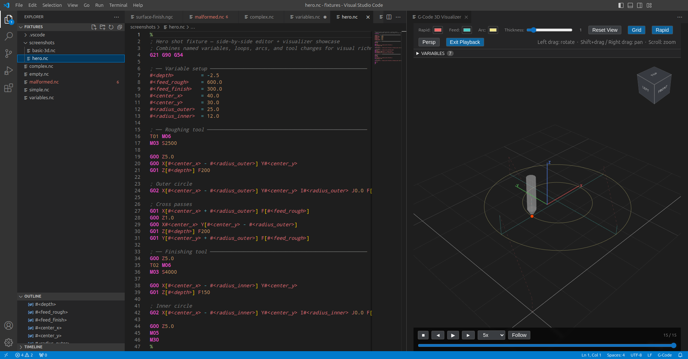

## Features

### Syntax Highlighting

Semantic token-based highlighting for G-Code files with 50+ file extensions.

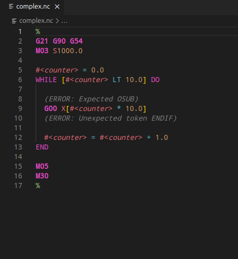

### Hover Documentation

Intelligent tooltips showing variable values and declarations, G/M command descriptions with parameters and examples, operator and function documentation, and axis parameter meanings.

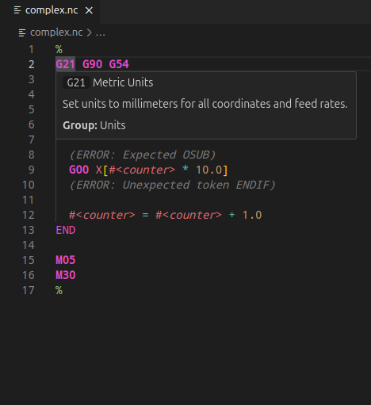

### Code Completions

Dialect-aware IntelliSense with snippets and grouping for G/M commands, parameters, variables, functions, and operators.

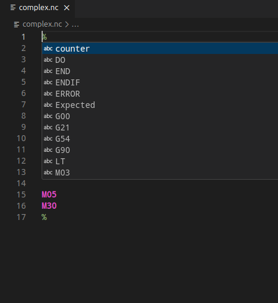

### Document Formatting

Intelligent formatting with customizable options and dialect-specific syntax. Supports format on save, range formatting, and dialect-specific control flow syntax.

| Before formatting                                              | After formatting                                             |
| -------------------------------------------------------------- | ------------------------------------------------------------ |
| 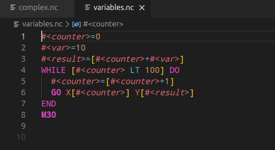 | 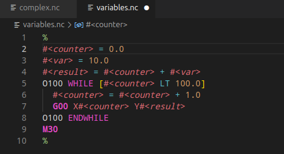 |

### 3D Tool-Path Visualizer

Interactive 3D view of cutting paths with orbit, pan, and zoom.

| Basic toolpath                                                  | Complex multi-pass surface                                        |
| --------------------------------------------------------------- | ----------------------------------------------------------------- |
| 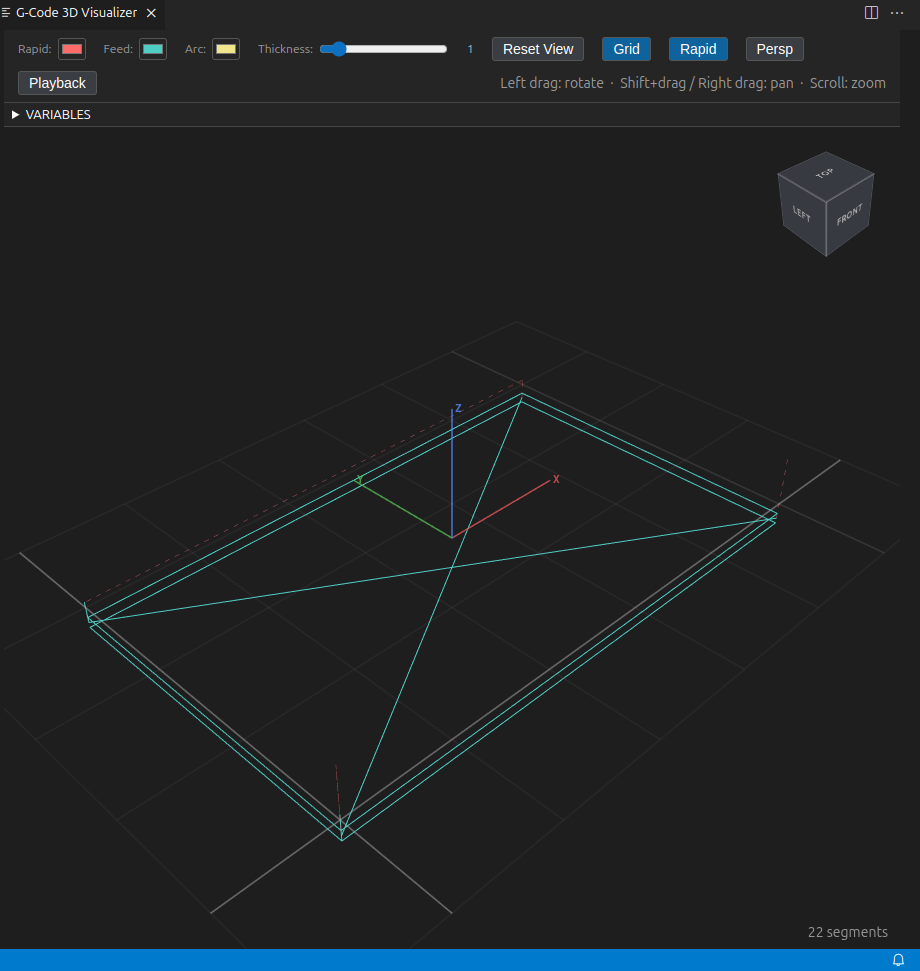 | 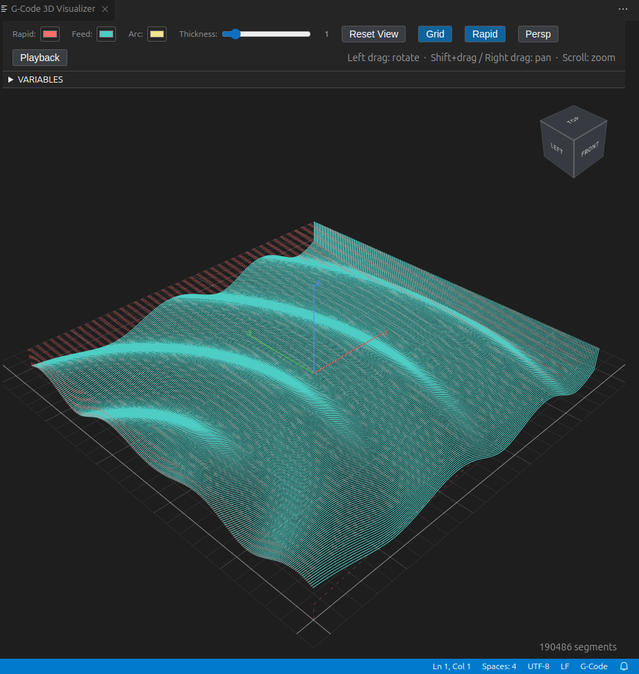 |

Additional visualizer features:

- Tool-path animation and playback with play, pause, step, and speed controls

  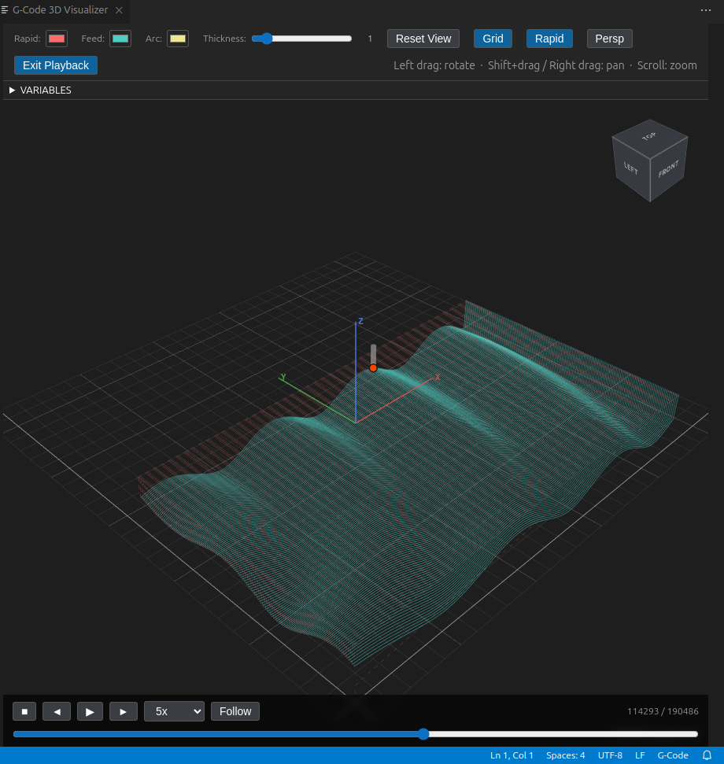

- ViewCube navigation gizmo for preset camera angles (faces and edges)
- Variable panel showing referenced and settings variables with inline override editing
- Segment hover, selection, and info panel (feed rate, spindle speed, tool number)
- Click-to-navigate from 3D segments to source G-code lines
- Arc plane support (G17/G18/G19) and G28 home position
- Pre-load variables from settings for accurate path visualization
- Reference grid, configurable colors and line widths
- Off-thread parsing with loading indicator for large files
- Live-update on document change

### Diagnostics

Syntax error reporting with severity levels, quick-fix code actions, and intelligent error suggestions.

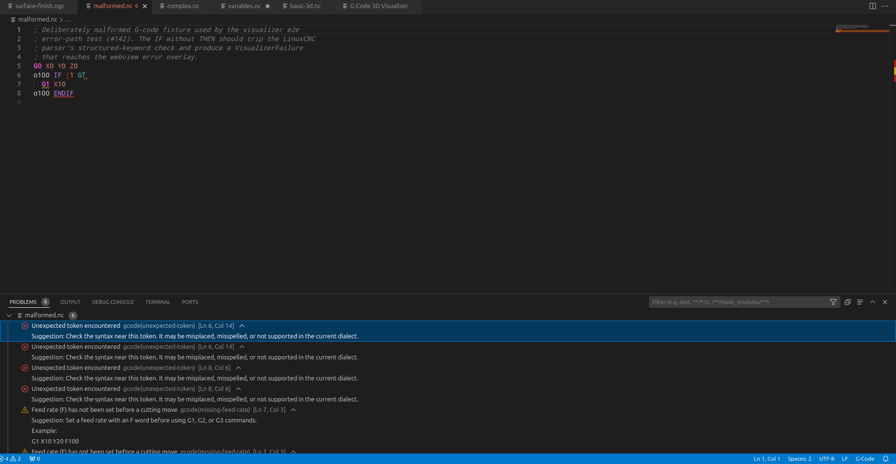

### Symbol Navigation

Hierarchical document outline — symbols grouped by subroutine with IF/WHILE blocks as children.

| Symbols outline                                        | Symbol quick-pick                                           |
| ------------------------------------------------------ | ----------------------------------------------------------- |
| 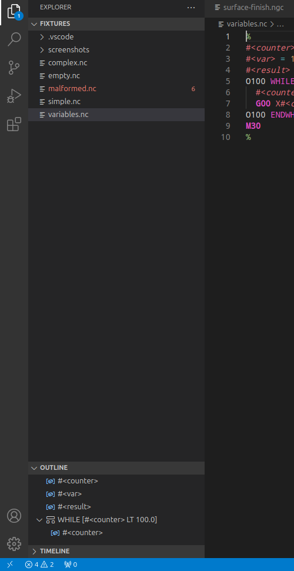 | 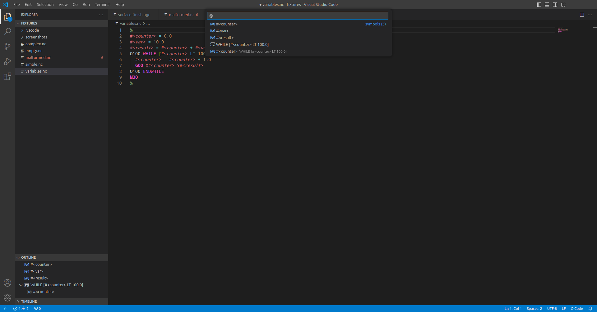 |

### Additional Features

- **Go to Definition / Find References**: Navigate to variable assignments and find all usages
- **Workspace Symbol Search**: Find G/M commands, variables, subroutines, and labels across the whole workspace (Ctrl+T). Indexing honours `files.exclude` and `search.exclude` so build and cache directories are omitted.
- **Code Folding**: Fold IF/WHILE/subroutine blocks
- **Variable Renaming**: Rename variables across entire document
- **Document Highlights**: Highlight all occurrences of a variable
- **Semantic Analysis**: Modal state tracking and dialect-aware axis parameter validation
- **Multi-Program Support**: Parse and navigate files containing multiple programs
- **Subroutine Support**: Parsing and formatting of subroutines across all four dialects
- **Robust Error Handling**: Parser gracefully handles unsupported syntax — preserves original code and continues parsing after errors
- **Custom Theme**: Dedicated G-Code color theme for optimal readability
- **Language Server**: LSP-based architecture for fast and reliable language features
- **Format on Save** and **Range Formatting**

## Supported File Extensions

The extension supports a wide range of G-Code file extensions including:

- `.nc`, `.ngc` - Numerical Control / Numerical G-Code
- `.g`, `.gc`, `.gcode` - Standard G-Code
- `.tap` - TAP files
- `.m`, `.mpf`, `.spf` - Fanuc/Heidenhain formats
- `.sbp` - ShopBot files
- And 40+ more extensions (see `package.json` for complete list)

## Dialect Support

The extension supports multiple G-code dialects/flavors to provide accurate completions and documentation specific to your CNC control system:

- **LinuxCNC** (default) - Extended G-code with named variables (#<name>), conditional statements (IF/THEN/ELSE), and various control flow constructs
- **Fanuc** - Industry standard for mills and lathes, featuring G65 macro calls, numeric variables (#1-#999), M98/M99 subprograms, and standard canned cycles
- **Haas** - Mill-specific G-codes with VPS smoothing, G187 accuracy control, and M95-M99 jump labels
- **Siemens/Sinumerik** - Extended G-code range (beyond G99), R parameters, polar programming, and advanced interpolation modes

### Changing the Dialect

Set your preferred dialect in VS Code settings:

```json
{
  "gcode.dialect": "fanuc"
}
```

Available values: `"linuxcnc"`, `"fanuc"`, `"haas"`, `"siemens"`

The dialect setting affects:

- **Completions**: Shows commands and parameters specific to your dialect
- **Hover documentation**: Displays dialect-specific command descriptions and examples
- **IntelliSense**: Provides accurate parameter suggestions for commands
- **Formatting**: Applies dialect-specific control flow syntax (e.g., Siemens omits THEN/DO keywords)

Dialect changes take effect immediately without needing to reload VS Code.

### Dialect-Specific Formatting

The formatter automatically adjusts control flow syntax based on your selected dialect:

**LinuxCNC/Siemens** (no THEN/DO keywords):

```gcode
IF [#<x> GT 0]
  G01 X10
ENDIF

WHILE [#<counter> LT 10]
  G01 X[#<counter>]
ENDWHILE
```

**Fanuc/Haas** (with THEN/DO keywords):

```gcode
IF [#<x> GT 0] THEN
  G01 X10
ENDIF

WHILE [#<counter> LT 10] DO
  G01 X[#<counter>]
END
```

**Key differences**:

- **LinuxCNC/Siemens**: Omit `THEN` and `DO` keywords, use `ENDWHILE`
- **Fanuc/Haas**: Use `IF...THEN`, `WHILE...DO`, and `END`
- **Siemens**: Labels use colon suffix (e.g., `O100:` instead of `O100`)

## Installation

### From VS Code Marketplace

1. Open VS Code
2. Go to Extensions view (`Ctrl+Shift+X` / `Cmd+Shift+X`)
3. Search for "G-Code Language Support"
4. Click Install

or

1. Open VS Code
2. Open Quick Open (`Ctrl+P` / `Cmd+P`)
3. Paste `ext install QuickBoyz.vscode-gcode-extension` and press `Enter`

### From VSIX Package

1. Download the `.vsix` file from the [Releases](https://github.com/QuickBoyz/vscode-gcode-extension/releases) page
2. Open VS Code
3. Go to Extensions view
4. Click the `...` menu and select "Install from VSIX..."
5. Select the downloaded `.vsix` file

## Usage

### Format Document

Use the command palette (`Ctrl+Shift+P` / `Cmd+Shift+P`) and run:

- **G-Code: Format G-Code Document**

Or use the standard VS Code format document shortcut (`Shift+Alt+F` / `Shift+Option+F`).

### Format on Save

Enable format on save in VS Code settings:

```json
{
  "editor.formatOnSave": true,
  "[gcode]": {
    "editor.formatOnSave": true
  }
}
```

## Extension Settings

This extension contributes the following settings:

| Setting                                      | Default         | Description                                                                  |
| -------------------------------------------- | --------------- | ---------------------------------------------------------------------------- |
| `gcode.dialect`                              | `"linuxcnc"`    | Select the G-code dialect/flavor for completions and documentation           |
| `gcode.formatter.addLineNumbers`             | `false`         | Add N-block line numbers to each line (N10, N20, etc.)                       |
| `gcode.formatter.lineNumberStart`            | `10`            | Starting line number when adding N-blocks                                    |
| `gcode.formatter.lineNumberIncrement`        | `10`            | Line number increment when adding N-blocks                                   |
| `gcode.formatter.prettyPrintCommands`        | `true`          | Pretty-print G and M codes with two digits (G1 → G01, M3 → M03)              |
| `gcode.formatter.prettyPrintNumbers`         | `true`          | Pretty-print parameter numbers to always include a decimal point (X2 → X2.0) |
| `gcode.formatter.indent`                     | `true`          | Enable indentation for control structures (WHILE, IF, etc.)                  |
| `gcode.formatter.compactOutput`              | `false`         | Compact output mode - removes all empty lines                                |
| `gcode.formatter.addProgramDelimiters`       | `true`          | Add program delimiters (%) at the beginning and end if not present           |
| `gcode.visualizer.rapidColor`                | `"#ff6b6b"`     | Colour for rapid (G0) moves in the 3D visualizer                             |
| `gcode.visualizer.feedColor`                 | `"#4ecdc4"`     | Colour for linear feed (G1) moves in the 3D visualizer                       |
| `gcode.visualizer.arcColor`                  | `"#f0e68c"`     | Colour for arc (G2/G3) moves in the 3D visualizer                            |
| `gcode.visualizer.lineThickness`             | `1`             | Line thickness (pixels) for tool-path lines                                  |
| `gcode.visualizer.showGrid`                  | `true`          | Show reference grid on the XY plane                                          |
| `gcode.visualizer.gridSpacing`               | `10`            | Grid line spacing in work units (mm or inches)                               |
| `gcode.visualizer.showRapidMoves`            | `true`          | Show rapid (G0) moves in the 3D visualizer                                   |
| `gcode.visualizer.projection`                | `"perspective"` | Projection mode: `"perspective"` or `"orthographic"`                         |
| `gcode.visualizer.playback.rapidSpeed`       | `10000`         | Rapid traverse speed in mm/min for playback animation                        |
| `gcode.visualizer.playback.defaultFeedRate`  | `1000`          | Fallback feed rate in mm/min when no F value is set                          |
| `gcode.visualizer.playback.followSourceLine` | `false`         | Auto-scroll editor to current source line during playback                    |
| `gcode.variables`                            | `{}`            | Global variable values pre-loaded before program execution                   |
| `gcode.workspace.indexingEnabled`            | `true`          | Enable workspace-wide symbol indexing for Ctrl+T search                      |
| `gcode.workspace.maxSymbols`                 | `10000`         | Maximum number of symbols to index across all workspace files                |

### Workspace symbol indexing

When `gcode.workspace.indexingEnabled` is `true`, the extension scans the workspace at startup and keeps the index in sync with external edits so Ctrl+T finds symbols from files that have never been opened.

File discovery runs on the client (via `vscode.workspace.findFiles`) so it automatically honours the two standard VS Code exclude settings:

- **`files.exclude`** — directories hidden from the explorer (typical: `**/node_modules`, `**/build`, `**/dist`)
- **`search.exclude`** — directories hidden from text search (typical: `**/cache`, `**/out`, `**/.tmp`)

Anything matched by either glob set is skipped by the indexer. Changing these settings triggers a debounced rescan (≈200 ms), so moving a directory into or out of the exclude set reconciles on the next idle tick.

**Known limitations**

- **Eventual consistency on watcher events.** File-watcher events are applied unconditionally — a create/delete inside an excluded directory is briefly indexed before the next full-rescan trigger removes it. For typical build/cache paths this is invisible; if you need strict filtering at the watcher level, toggle the root setting off and on.
- **Multi-root workspaces use a single dialect.** The dialect setting is read once per scan. Per-folder dialect support in multi-root workspaces is tracked separately (#141).
- **`files.watcherExclude` is not consulted.** See the upstream VS Code limitation [microsoft/vscode#151211](https://github.com/microsoft/vscode/issues/151211) — watcher-exclude globs are not surfaced through the extension API.
- **`.gitignore` is not additionally honoured once an exclude is configured.** When `files.exclude` or `search.exclude` are non-empty, the workspace indexer passes a custom glob to `vscode.workspace.findFiles`, and VS Code's second argument uses replace semantics rather than augmenting the built-in defaults — so `.gitignore` / `search.useIgnoreFiles` are not consulted alongside the custom exclude. A workspace with zero configured excludes still gets the built-in defaults.

## Architecture

This extension uses a Language Server Protocol (LSP) architecture with a strict layered pipeline:

```
┌─────────────────┐   ┌──────────────────────┐
│  VS Code Client │   │  3D Visualizer Panel  │
│  (extension.ts) │   │  (webview + extractor)│
└────────┬────────┘   └──────────┬───────────┘
         │ IPC                   │
         │                       │
┌────────▼────────┐              │
│ Language Server  │              │
│   (server.ts)   │              │
└────────┬────────┘              │
         │                       │
┌────────▼───────────────────────▼──┐
│          Providers / Services     │
│  (completions, hover, diagnostics,│
│   formatting, symbols, folding)   │
└────────┬──────────────────────────┘
         │
    ┌────┴────┬──────────┬────────────┐
    │         │          │            │
┌───▼───┐ ┌──▼───┐ ┌────▼────┐ ┌─────▼─────┐
│ Lexer │ │Parser│ │Formatter│ │ Databases │
└───────┘ └──────┘ └─────────┘ └───────────┘
```

### Project Structure

```
src/
├── client/          # VS Code extension client
│   ├── extension.ts # Extension entry point
│   ├── CommandProvider.ts
│   ├── GCodeVisualizerPanel.ts
│   ├── VisualizerService.ts
│   └── WorkerClient.ts
├── server/          # Language Server implementation
│   └── server.ts    # LSP server setup
├── lexer/           # Hand-written character scanner
│   ├── GCodeScanner.ts
│   ├── GCodeLexer.ts
│   └── LexerFactory.ts
├── parser/          # Multi-dialect parser (AST generation)
│   ├── BaseParser.ts
│   ├── ParserFactory.ts
│   ├── AstFactory.ts
│   ├── AstTraverser.ts
│   ├── AstVisitor.ts
│   ├── BaseAstVisitor.ts
│   ├── nodes/       # AST node definitions
│   └── dialects/    # LinuxCNC, Fanuc, Haas, Siemens parsers
├── formatter/       # Code formatter
│   ├── BaseFormatter.ts
│   ├── FormatterFactory.ts
│   ├── ExpressionFormatter.ts
│   └── dialects/    # Dialect-specific formatters
├── databases/       # G/M-code command reference data
│   └── dialects/    # Dialect-specific databases
├── visualizer/      # 3D tool-path extraction (VS Code-free)
│   ├── GCodePathExtractor.ts
│   ├── GCodeInterpreter.ts
│   ├── GCodeExpressionEvaluator.ts
│   ├── VariableResolutionService.ts
│   └── VariableEnvironment.ts
├── webview/         # 3D visualizer React app
│   ├── components/  # React components (variable panel, etc.)
│   ├── playback/    # Animation/playback engine
│   └── viewCube/    # ViewCube navigation gizmo
├── providers/       # LSP service layer
│   ├── CompletionProvider.ts
│   ├── DefinitionProvider.ts
│   ├── ReferencesProvider.ts
│   ├── DiagnosticsProvider.ts
│   ├── DocumentFormattingProvider.ts
│   ├── DocumentSymbolProvider.ts
│   ├── DocumentHighlightProvider.ts
│   ├── FoldingRangeProvider.ts
│   ├── HoverProvider.ts
│   ├── RenameProvider.ts
│   ├── SemanticTokensProvider.ts
│   ├── WorkspaceSymbolProvider.ts
│   ├── DataProviderFactory.ts
│   └── dialects/    # Dialect-specific data providers
├── test/            # Unit tests (Jest)
│   └── fixtures/    # Test fixtures (.nc files)
└── e2e/             # E2E tests (VS Code Extension Host)
    ├── suite/       # Test suites
    └── fixtures/    # Test fixtures
```

## Development

### Prerequisites

- Node.js 18+ and npm
- Visual Studio Code
- TypeScript knowledge

### Setup

1. Clone the repository:

```bash
git clone https://github.com/QuickBoyz/vscode-gcode-extension.git
cd vscode-gcode-extension
```

2. Install dependencies:

```bash
npm install
```

3. Build the project:

```bash
npm run build
```

### Development Workflow

1. **Make changes** to the source files in `src/`
2. **Build** the project: `npm run build`
3. **Test** your changes: `npm test`
4. **Debug** the extension:
   - Press `F5` in VS Code to launch a new Extension Development Host window
   - Open a G-Code file in the new window to test your changes
5. **Package** the extension: `npm run package`

### Available Scripts

- `npm run build` - Compile TypeScript to JavaScript
- `npm run build:e2e` - Compile test files
- `npm run typecheck` - Type check without emitting files
- `npm test` - Run unit tests (Jest)
- `npm run test:watch` - Run unit tests in watch mode
- `npm run test:e2e` - Run e2e tests (VS Code)
- `npm run test:all` - Run both unit and e2e tests
- `npm run package` - Build and package the extension as `.vsix`
- `npm run package:pre` - Build and package as pre-release

### Testing

The project uses two types of tests:

1. **Unit Tests (Jest)**: Test individual components in isolation
   - Located in `src/test/` directory
   - Run with: `npm test`
   - Run in watch mode: `npm run test:watch`
   - Fast, isolated tests for parsers, formatters, and providers

2. **E2E Tests (VS Code)**: Test features end-to-end in VS Code Extension Development Host
   - Located in `src/e2e/` directory
   - Run with: `npm run test:e2e`
   - Run all tests: `npm run test:all`
   - Tests actual VS Code integration (formatting, symbols, highlighting, rename, semantic tokens)

For detailed information about testing, see [TESTING.md](TESTING.md).

### Debugging

1. Open the project in VS Code
2. Press `F5` to launch the Extension Development Host
3. Set breakpoints in your code
4. The debugger will attach automatically

You can also debug the Language Server by setting breakpoints in `src/server/server.ts`.

## Contributing

We welcome contributions! Please see [CONTRIBUTING.md](CONTRIBUTING.md) for guidelines on:

- Code style and standards
- Submitting pull requests
- Reporting bugs
- Feature requests
- Development setup

## Requirements

- VS Code 1.85.0 or higher
- No additional dependencies needed for end users

## Known Issues

None at this time. Please report issues on [GitHub Issues](https://github.com/QuickBoyz/vscode-gcode-extension/issues).

## Release Notes

See [CHANGELOG.md](CHANGELOG.md) for detailed release notes.

## License

MIT License - see [LICENSE](LICENSE) file for details.

## Acknowledgments

- Built with [VS Code Language Server Protocol](https://microsoft.github.io/language-server-protocol/)

---

**Enjoy coding in G-Code!**
